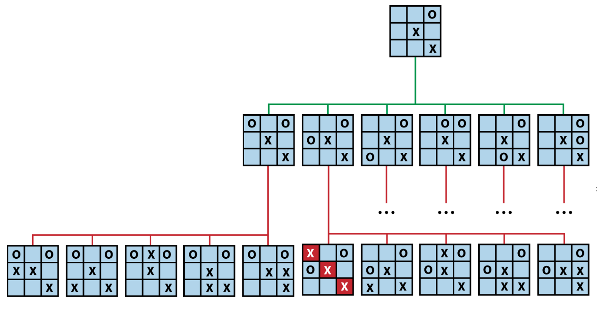

# Unbeatable Tic-Tac-Toe using MINIMAX algorithm

## How it works



The algorithm must find a move that leads to the greatest chance of victory or at least a draw.

Each level of the tree switches back and forth between MAX levels (where the objective is to help the computer player by maximizing the score) and MIN levels (where the objective is to help the adversary by minimizing the score).

Given a specific game state, `function score(board)` is evaluation function that returns an integer representing the score of the game from the player’s perspective.

```typescript
function score(board: Board): -1 | 0 | 1 {
	const winner =...

	if(winner === 'player') return -1
	if(winner === 'computer') return 1

	// draw or game is not yet finished.
	return 0
}
```

## References

- [Algorithms in a Nutshell](https://www.oreilly.com/library/view/algorithms-in-a/9780596516246/)
